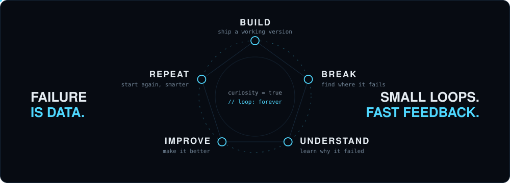
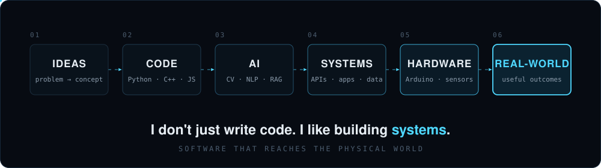
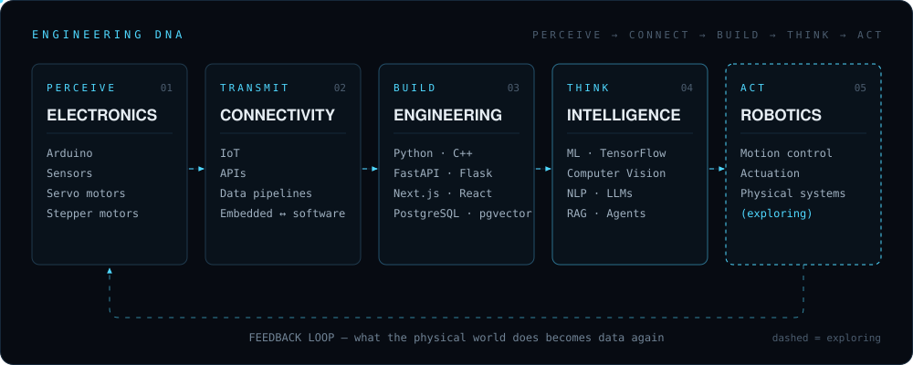
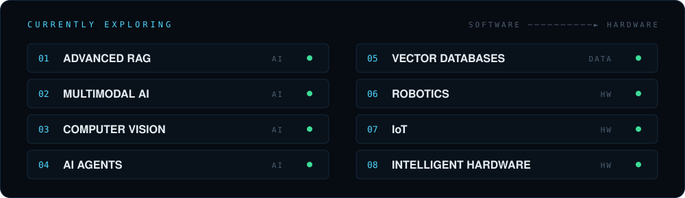

<!--
  raushan@engineering-lab:~$ cat README.md
  if you're reading the source: hello.
  > curiosity = true
-->

<div align="center">



<a href="#engineering-philosophy"><code>PHILOSOPHY</code></a> &nbsp;·&nbsp;
<a href="#what-i-build"><code>WHAT I BUILD</code></a> &nbsp;·&nbsp;
<a href="#recently-developed"><code>RECENT PROJECT</code></a> &nbsp;·&nbsp;
<a href="#current-build-status"><code>STATUS</code></a> &nbsp;·&nbsp;
<a href="#github-command-center"><code>COMMAND CENTER</code></a> &nbsp;·&nbsp;
<a href="#lets-build-something"><code>CONNECT</code></a>

<br/><br/>



</div>


<!-- ═══════════ SCREEN 02 ═══════════ -->

<p align="center"><sub><code>SCREEN 02 / PHILOSOPHY</code></sub></p>

<h2 align="center" id="engineering-philosophy">ENGINEERING PHILOSOPHY</h2>

<div align="center">



<i>Models overfit. Circuits short. Code breaks.<br/>Every failure is just the fastest feedback loop I have.</i>

</div>


<!-- ═══════════ SCREEN 03 ═══════════ -->

<p align="center"><sub><code>SCREEN 03 / SYSTEMS</code></sub></p>

<h2 align="center" id="what-i-build">WHAT I BUILD</h2>

<div align="center">



<br/><br/>



</div>

<br/>

<h3 align="center">STACK MAP</h3>

<table align="center">
<tr>
<td><code>LANGUAGES</code></td>
<td></td>
<td><sub>Python · C++ · Java · JavaScript · SQL</sub></td>
</tr>
<tr>
<td><code>AI / ML</code></td>
<td></td>
<td><sub>YOLO · Hugging Face · Sentence Transformers · NLP · Computer Vision · LLMs · RAG</sub></td>
</tr>
<tr>
<td><code>WEB / API</code></td>
<td></td>
<td><sub>React · Next.js · FastAPI · Flask · Node.js · Streamlit</sub></td>
</tr>
<tr>
<td><code>DATA / SEARCH</code></td>
<td></td>
<td><sub>PostgreSQL · pgvector · FAISS · Embeddings · Semantic Search · Ollama · Local LLMs</sub></td>
</tr>
<tr>
<td><code>HARDWARE</code></td>
<td></td>
<td><sub>Arduino · Sensors · Servo &amp; Stepper Motors · Embedded Systems · IoT</sub></td>
</tr>
<tr>
<td><code>TOOLING</code></td>
<td></td>
<td><sub>Git · GitHub · VS Code · Docker</sub></td>
</tr>
</table>


<!-- ═══════════ SCREEN 04 ═══════════ -->

<p align="center"><sub><code>SCREEN 04 / RECENT BUILD</code></sub></p>

<h2 align="center" id="recently-developed">RECENTLY DEVELOPED PROJECT</h2>

<!-- RECENT-PROJECT-START -->
<div align="center">

<a href="https://frontend-phi-topaz-18.vercel.app/">
  
</a>

<br/><br/>

<a href="https://frontend-phi-topaz-18.vercel.app/"></a>
&nbsp;
<a href="https://github.com/anurohan/osho-ai"></a>

</div>
<!-- RECENT-PROJECT-END -->


<!-- ═══════════ SCREEN 05 ═══════════ -->

<p align="center"><sub><code>SCREEN 05 / EXPERIMENTS</code></sub></p>

<h2 align="center" id="current-build-status">CURRENT BUILD STATUS</h2>

<div align="center">



</div>

<h3 align="center">BUILD LOG / 2026</h3>

```text
BUILD LOG / 2026
═══════════════════════════════════════════════════════════════
[01] RAG SYSTEMS        retrieval · embeddings · local LLMs
[02] MULTIMODAL AI      text + images + documents, one pipeline
[03] COMPUTER VISION    detection · real-time video
[04] AI AGENTS          tools · planning · orchestration
[05] ROBOTICS           motion · control · actuation
[06] AI + HARDWARE      models that act in the physical world
═══════════════════════════════════════════════════════════════
> next: connect all of it.
```


<!-- ═══════════ SCREEN 06 ═══════════ -->

<p align="center"><sub><code>SCREEN 06 / TELEMETRY</code></sub></p>

<h2 align="center" id="github-command-center">GITHUB COMMAND CENTER</h2>

<table align="center">
<tr>
<td width="50%" align="center">

</td>
<td width="50%" align="center">

</td>
</tr>
<tr>
<td colspan="2" align="center">

</td>
</tr>
<tr>
<td colspan="2" align="center">

</td>
</tr>
</table>


<!-- ═══════════ SCREEN 07 ═══════════ -->

<p align="center"><sub><code>SCREEN 07 / CONNECT</code></sub></p>

<h2 align="center" id="lets-build-something">LET'S BUILD SOMETHING</h2>

<p align="center">
If you're working on AI, robotics, or anything that connects software to the physical world,<br/>I'd like to hear about it.
</p>

<p align="center">
<a href="https://github.com/anurohan"></a>
&nbsp;
<a href="https://www.linkedin.com/in/raushan-kumar-verma"></a>
&nbsp;
<a href="https://portpholio-cyan.vercel.app/"></a>
&nbsp;
<a href="mailto:raushanverma1240@gmail.com"></a>
&nbsp;
<a href="https://portpholio-cyan.vercel.app/Raushan_Kumar_CV.pdf"></a>
</p>

```text
> system.initialize()
> curiosity = true
> limitations = undefined
404: limits not found.
```

<p align="center">

</p>
